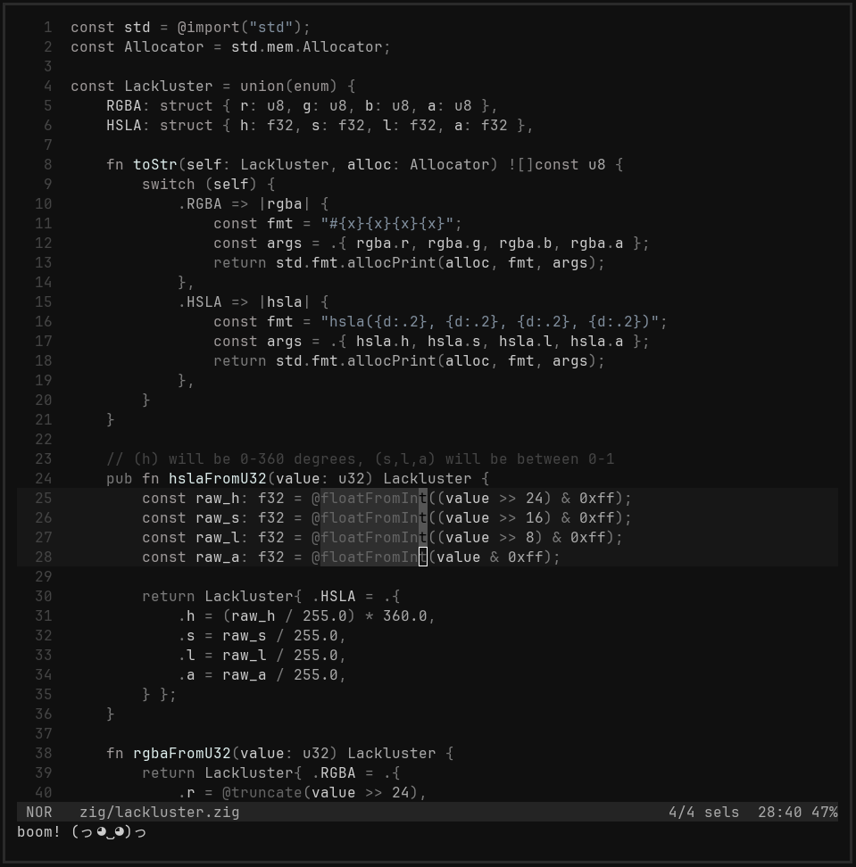

# editor is a personal helix fork
> A rediculously fun helix fork for the workman keyboard layout

## CONSTRUCTION
I'm still making tweeks so its not exactly stable yet.

## About
I made this for myself and it may not be for you. It's super opinionated, and changes some of the
default helix behavior. That said I think its rediculously fun and if you use the workman layout,
you may like it too. It pulls from ideas I have developed with a workman-layout neovim plugin I created
called [unruly-worker.nvim](https://github.com/slugbyte/unruly-worker.nvim). When I first switched
to helix I quickly found that lots of keymaps can not yet be configured without forking and directly
moding the codebase. Once I made a few key map mods, I got a little more adventurous and added a few
tweaks and features, and boom here we are. So far its been a really fun setup for me!

## Fork Profile: Changes and Preferences
This fork is optimized for my personal workflow and muscle memory, not default Helix ergonomics.

### Core preferences
* Workman-first keymap layout and movement model.
* Terminal-first workflow with direct source builds.
* Fast picker and jump-heavy editing.

### Command additions
* `:rename` -> rename file in place.
* `:trash` or `:delete` -> move file to a trash path with timestamp naming.
* `:wa` -> write-all and show a random status emote as a visual save signal.

### Keymap preferences
* Keep the Workman mapping as primary.
* Adopt selected upstream additions that fit my layout.
* Added upstream-aligned entries:
  * `space .` -> current buffer directory explorer.
  * `space s` and `space S` -> syntax/LSP-aware symbol pickers.
  * `[` `x` and `]` `x` -> XML element navigation.

### Theme and UI preferences
* Default theme is `lackluster` (soft monochrome).
* Custom UI styling in picker, diagnostics, and gutter visuals.
* Query tweaks for comment severity tags and Zig function highlighting behavior.

### Build and binary preferences
* Binary branding is `e`.
* Version string includes build date metadata.
* Keep custom local workflows in `Makefile`, plus `editor.desktop` and `TODO.md`.

### Upstream strategy
* Keep upstream jumplist strategy for easier merges.
* Carry local patches where they provide direct workflow wins.

## Version
This is a fork that tracks upstream `master` with local workflow patches.

## Installation
[You will need to build from source.](https://docs.helix-editor.com/building-from-source.html)

## Big Changes
> You can grep for "unruly" and find comments where I made changes
* I modified the keybinds everywhere to use the workman keyboard layout.
* I added push_jump to lots of commands because I heavly use the jumplist.
* I added some custom commands (seen below).
* The default theme is my own `lackluser`, a delightful mostly monochrome colorscheme thats soft on the eyes.

## Custom Typed Commands
* `:wa` -> will set **status** to *a* random emote (to visually see that a a write has occured)
* `:rename` -> rename file in place
* `:trash or :delete` -> move file to $trash/trash_(date)_(origional_name)

#### Lil Changes
* I tweeked some gutter symbols
* I tweaked which styles were being used for borders, diagnostic messages, and more
* I added a function.call zig's highlight.scm which let me highlight fn declarations and calls seperatly (for zig)

###  FINDING CHANGES
grep for slugbyte
